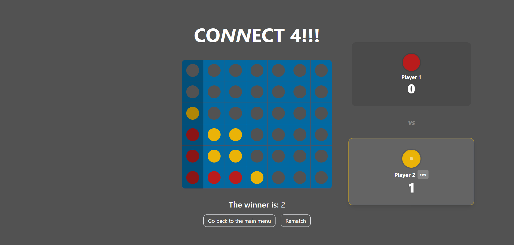

# Connect 4 Online

A real-time, multiplayer Connect 4 game designed to explore real-time synchronization, authoritative servers, and animation-state separation in a distributed environment.



## Why this project?

This project was built to explore:
-   **Real-time client-server synchronization** via WebSockets.
-   **Server-authoritative game logic** to prevent cheating and ensure fairness.
-   **Managing animation state** separately from logical game state for smooth UX across devices.
-   **Session persistence and expiration** in multiplayer environments.

## Tech Stack

### Client
-   **React** (TypeScript): Component-based UI.
-   **Tailwind CSS**: Utility-first styling for rapid, responsive design (including custom glassmorphism effects).
-   **Framer Motion**: Smooth animations for UI entry and the game pieces (e.g., falling chips, ghost chips).
-   **Socket.io-client**: Real-time bidirectional communication.
-   **Vite**: Fast build tool and dev server.

### Server
-   **Node.js & Express**: API and static file serving.
-   **Socket.io**: Real-time event handling with rooms and namespaces.
-   **Redis**: Used as an in-memory session store with TTL to ensure:
    -   Fast session lookup.
    -   Automatic cleanup of inactive users.
    -   Horizontal scalability via Socket.io adapter.
-   **Docker**: Containerization for Redis infrastructure.
-   **TypeScript**: Type safety across the full stack.

## Architecture Overview

The server acts as the **single source of truth** for all game state. Clients are treated as thin views that only render state sent by the server.

This approach prevents:
-   **Client-side manipulation** (anti-cheat).
-   **Desynchronization** between players.
-   **Race conditions** during simultaneous actions.

### Key Features
1.  **Session Management**:
    -   **Redis** to store user sessions with a TTL (Time To Live).
    -   **Auto-refresh**: Game moves refresh the session to prevent expiration during active play.
    -   **Inactivity Timer**: Clients log out after 1 hour of inactivity.

2.  **Real-Time Gameplay**:
    -   **Room-based**: Private game rooms created via unique invite links.
    -   **Synchronization**: Server is the single source of truth for the board state.

3.  **Responsiveness**:
    -   The game board adapts to mobile and desktop screens.
    -   Chip animations dynamically calculate drop distance based on screen size (48px vs 80px cells).

## Challenges & Solutions

### 1. Client-Server Sync & Animation
**Problem**: Syncing the "falling chip" animation with the logical board update.
**Solution**:
-   Separated the *animation state* (`fallingChip`) from the *logical board state*.
-   Server broadcasts result -> Client calculates animation target -> Animation plays -> Chip "sleeps" (becomes part of static board).

### 2. Session Consistency
**Problem**: Users getting disconnected or sessions expiring during long games.
**Solution**:
-   Implemented a "keep-alive" mechanism: every valid game move refreshes the session TTL.
-   Client-side inactivity detection prevents "phantom" active sessions.

## Setup Instructions

### Prerequisites
-   Node.js (v16+)
-   pnpm
-   Redis server

### 1. Clone & Install
```bash
git clone <repository_url>
cd Connect4Online
```

### 2. Start Infrastructure
Ensure Docker is running, then start the Redis service:
```bash
docker compose up -d
```

### 3. Server Setup
```bash
cd connect4server
pnpm install
cp .env.example .env
# Edit .env if needed
pnpm start
```

### 4. Client Setup
```bash
cd ../connect4
pnpm install
cp .env.example .env
# Edit .env if needed
pnpm run dev
```


## What I Learned

-   **Designing server-authoritative real-time systems**: Balancing security with perceived latency.
-   **Separating animation state from domain logic**: Allowing the UI to be fluid (e.g. falling chips) while the game logic remains instantaneous and deterministic.
-   **Managing transient UI state**: Handling "ghost chips" and hover states in a networked environment.
-   **Session Management**: Handling session expiration gracefully without disrupting active users.

## Possible Improvements

-   **Reconnection logic**: To restore ongoing games after temporary network loss.
-   **Persistent match history**: Storing results in a relational DB (Postgres) for leaderboards.
-   **Matchmaking service**: Replacing direct invites with a queue-based matching system.
-   **Horizontal scaling**: Implementing multiple Socket.io nodes using the existing Redis adapter.
